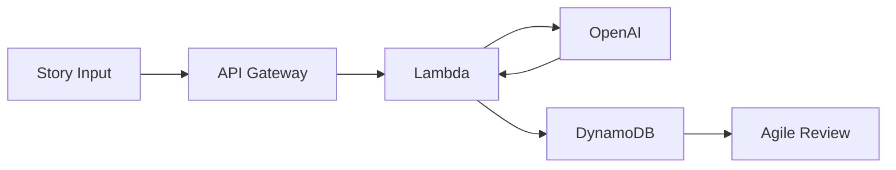

# Application Flow

## User Journey
1. Story Input
   - User enters story title
   - User writes user story
   - User adds acceptance criteria
   - User clicks "Analyze Story"

2. Agile Coach Analysis
   - Story is sent to OpenAI
   - AI analyzes and improves:
     - Title
     - Story text
     - Acceptance criteria
   - AI provides:
     - INVEST analysis
     - Suggestions
   - Results stored in DynamoDB with version "AGILE_COACH"

3. Review & Edit
   - User reviews improved story
   - Can edit:
     - Improved title
     - Improved story
     - Acceptance criteria
   - Reviews:
     - INVEST analysis
     - Suggestions
   - Sends to Tech Review

## Data Flow
