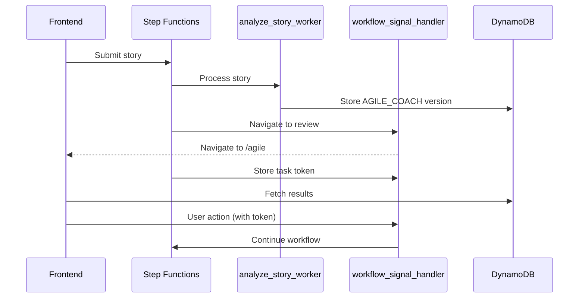

# Story Analysis Workflow Documentation

## Quick Reference for AI Integration

### Key Components
1. Frontend (Vue.js)
   - StoryInput.vue: Initial story submission
   - AgileReview.vue: AI analysis review
   - TechReview.vue: Technical review
   - Estimates.vue: Team estimation display

2. Backend (AWS)
   - analyze_story Lambda: Initial processing
   - analyze_story_worker Lambda: AI analysis
   - workflow_signal_handler Lambda: Handles state transitions and navigation
   - TechnicalReviewWorker Lambda: Senior dev review
   - TeamEstimationWorker Lambda: Parallel estimation

3. Data Storage
   - DynamoDB: agile_stories (story versions)
   - DynamoDB: estimations (team estimates)

### Core Data Types
# TypeScript Interfaces
    interface Story {
      story_id: string;
      version: StoryVersion;
      tenant_id: string;
      content: {
        title: string;
        description: string;
        story: string;
        acceptance_criteria: string[];
      };
      analysis?: Analysis;
      technical_review?: TechnicalReview;
      estimation?: Estimation;
      created_at: string;
      updated_at: string;
    }

    type StoryVersion = 
      | 'AGILE_COACH_PENDING'
      | 'AGILE_COACH'
      | 'SENIOR_DEV_PENDING'
      | 'SENIOR_DEV'
      | 'ESTIMATION_PENDING'
      | 'ESTIMATION_COMPLETE'
      | 'FINAL';

    interface Estimation {
      estimation_id: string;
      story_id: string;
      role: string;
      estimate: number;
      justification: string;
      created_at: string;
    }

### Component Relationships and Task Token Flow
    StoryInput.vue -> analyze_story Lambda -> DynamoDB (AGILE_COACH_PENDING)
                                         -> Step Functions
                                            -> analyze_story_worker (AGILE_COACH)
                                            -> Wait 3s (simulate AI)
                                            -> Navigate to AgileReview.vue
                                            -> WaitForUserAction (with task token)

### Critical State Transitions
1. Story Submission
   - StoryInput -> AGILE_COACH_PENDING
   - analyze_story_worker creates AGILE_COACH version
   - Step Functions handles navigation to AgileReview
   - Frontend displays results using stored token

2. Technical Review
   - User clicks "Continue to Technical Review"
   - Frontend uses task token to signal workflow
   - Workflow moves to SENIOR_DEV_PENDING
   - Technical review process begins

3. Estimation (Asynchronous)
   - Similar task token pattern for estimation flow
   - Parallel processing for team estimates
   - Task tokens manage state transitions

## State Management with Task Tokens

### Token Flow Architecture
1. **State Storage (DynamoDB)**
   - Table: agile_stories
   - Key fields:
     - story_id (primary)
     - version (sort key)
     - task_token (when waiting for user action)
     - created_at/updated_at

2. **Lambda Handlers**
   - workflow_signal_handler:
     - Handles navigation between states
     - Manages task tokens for user actions
     - Signals Step Functions to continue flow

### State Transitions with Task Tokens

### Critical State Points
1. **Story Submission**
   - analyze_story creates PENDING version
   - Returns story_id and token to frontend

2. **Analysis Complete**
   - analyze_story_worker creates AGILE_COACH version
   - Step Functions triggers navigation
   - Frontend fetches and displays results

3. **User Actions**
   - Step Functions provides task token
   - Frontend uses token to signal next step
   - Workflow continues based on user choice

## Workflow Summary

### State Flow Diagram

    [StoryInput] --> (AGILE_COACH_PENDING) --[sync]--> (AGILE_COACH)
                                                         |
    [AgileReview] <----------------------------------------
         |
         |--(edit/accept)--> (SENIOR_DEV_PENDING) --[sync]--> (SENIOR_DEV)
                                                                |
    [TechReview] <--------------------------------------------
         |
         |---(accept)----------------> (FINAL)
         |
         |---(estimate)--> (ESTIMATION_PENDING) --[parallel]--> (ESTIMATION_COMPLETE)
                                                                |
                                                                |---(accept)---> (FINAL)
                                                                |
                                                                |---(revise)---> [TechReview]

### Key Points
1. Synchronous Operations (Frontend Waits):
   - Initial story analysis (AGILE_COACH_PENDING → AGILE_COACH)
   - Technical review (SENIOR_DEV_PENDING → SENIOR_DEV)

2. Asynchronous Operations:
   - Team estimation (parallel processing)
   - State machine monitoring
   - Navigation control

3. User Decision Points:
   - AgileReview: Accept/Edit AI suggestions
   - TechReview: Accept/Request Estimation
   - Estimation Review: Accept/Return for Revision

4. Data Versioning:
   - Stories: Complete version history
   - Estimations: Multiple rounds preserved
   - Final state includes chosen estimate

5. State Machine Control:
   - Monitors version changes
   - Triggers appropriate Lambdas
   - Controls page navigation
   - Manages parallel processes

---

## Initial Story Submission Flow

### 1. Frontend Interaction (StoryInput.vue)
- User enters story details in the StoryInput view
- Required fields:
  - Title
  - User Story text
  - Acceptance Criteria
- Submit button triggers `submitStory` function and enters loading state
- User remains on page until analysis is complete

### Code Implementation

const submitStory = async () => {
  try {
    loading.value = true
    const storyData = {
      tenant_id: 'test-tenant-001',
      content: {
        title: story.value.title,
        description: story.value.description,
        story: story.value.text,
        acceptance_criteria: story.value.acceptance_criteria.filter(c => c.trim() !== '')
      }
    }
    // Wait for complete analysis before proceeding
    const response = await submitStoryForAgileReview(storyData)
    
    // Only navigate once we have analysis results
    if (response.status === 'ANALYSIS_COMPLETE') {
      storyStore.setCurrentStoryId(response.story_id)
      router.push('/agile')
    } else {
      // Handle incomplete analysis
      console.error('Analysis not complete:', response.status)
    }
  } catch (error) {
    console.error('Error submitting story:', error)
  } finally {
    loading.value = false
  }
}

### 2. Backend Processing (analyze_story Lambda)
- API Gateway receives POST request and triggers Lambda
- Lambda function:
  - Generates unique story_id (UUID)
  - Creates timestamp
  - Stores story in DynamoDB with AGILE_COACH_PENDING status
  - Initiates Step Functions workflow
  - Waits for AnalyzeStoryWorker to complete
  - Returns analysis results to frontend

### Code Implementation

def handler(event, context):
    try:
        # Parse request and extract data
        body = json.loads(event['body'])
        content = body['content']
        tenant_id = body['tenant_id']

        # Generate IDs and timestamps
        story_id = str(uuid.uuid4())
        timestamp = datetime.utcnow().isoformat()
        
        # Store initial story
        item = {
            'story_id': story_id,
            'version': 'AGILE_COACH_PENDING',
            'tenant_id': tenant_id,
            'content': content,
            'created_at': timestamp,
            'updated_at': timestamp
        }
        
        # Save to DynamoDB and start workflow
        table.put_item(Item=item)
        workflow_input = {'story_id': story_id}
        
        # Start Step Functions and wait for analysis
        execution = sfn.start_execution(
            stateMachineArn=get_step_function_arn(),
            input=json.dumps(workflow_input)
        )
        
        # Wait for AnalyzeStoryWorker to complete
        while True:
            execution_status = sfn.describe_execution(
                executionArn=execution['executionArn']
            )
            if execution_status['status'] == 'SUCCEEDED':
                # Fetch analyzed story from DynamoDB
                analyzed_story = table.get_item(
                    Key={'story_id': story_id}
                ).get('Item')
                
                return {
                    'statusCode': 200,
                    'body': json.dumps({
                        'story_id': story_id,
                        'status': 'ANALYSIS_COMPLETE',
                        'analysis': analyzed_story.get('analysis')
                    })
                }
            elif execution_status['status'] == 'FAILED':
                raise Exception('Story analysis failed')
            
            time.sleep(1)  # Wait before checking again
            
    except Exception as e:
        return error_response(e)

### 3. Step Functions Workflow Initiation
- Workflow defined in workflow.json
- Sequential process through states:
  1. AnalyzeStoryWorker (Synchronous - Frontend waits)
     - State machine monitors DynamoDB for AGILE_COACH version
     - Controls navigation to AgileReview page
  2. TechnicalReview (Asynchronous)
     - Waits for user action on AgileReview page
     - Monitors for SENIOR_DEV_PENDING version
  3. TechnicalReviewWorker (Asynchronous)
  4. TeamEstimation (Asynchronous)
  5. TeamEstimationWorker (Asynchronous)

## Story Version States
1. AGILE_COACH_PENDING
   - Initial state when story is submitted
   - Waiting for analysis by AnalyzeStoryWorker
   - State machine monitors for completion

2. AGILE_COACH
   - Analysis complete
   - State machine triggers navigation to AgileReview page
   - Story displayed on AgileReview page
   - Contains AI-generated improvements and suggestions
   - User can edit or accept this version

3. SENIOR_DEV_PENDING
   - State after user accepts/edits story
   - State machine monitors for this state to trigger technical review
   - Waiting for technical review

4. SENIOR_DEV
   - Technical analysis complete
   - Contains senior developer feedback
   - Displayed on TechReview page
   - Two possible next states:
     - FINAL (direct approval)
     - ESTIMATION_PENDING (team estimation requested)

5. ESTIMATION_PENDING
   - Triggered by "Get Team Estimate" action
   - State machine launches parallel estimation processes
   - Each team role provides independent estimate

6. ESTIMATION_COMPLETE
   - All team estimates received
   - Average calculation stored with story content
   - Two options:
     - Accept and move to FINAL
     - Return to TechReview for revisions

7. FINAL
   - Story approved with all required analysis
   - Includes final content and chosen estimation
   - Ready for product backlog

## Data Persistence

### DynamoDB Schema

#### Stories Table
resource "aws_dynamodb_table" "agile_stories" {
  name         = "${var.environment}-agile-stories"
  billing_mode = "PAY_PER_REQUEST"
  hash_key     = "story_id"
  range_key    = "version"

  attribute {
    name = "story_id"
    type = "S"
  }

  attribute {
    name = "version"
    type = "S"
  }
}

#### Estimations Table
resource "aws_dynamodb_table" "estimations" {
  name         = "${var.environment}-agile-stories-estimations"
  billing_mode = "PAY_PER_REQUEST"
  hash_key     = "estimation_id"
  range_key    = "story_id"

  attribute {
    name = "estimation_id"
    type = "S"
  }

  attribute {
    name = "story_id"
    type = "S"
  }

  attribute {
    name = "created_at"
    type = "S"
  }

  global_secondary_index {
    name            = "story-created-index"
    hash_key        = "story_id"
    range_key       = "created_at"
    projection_type = "ALL"
  }
}

## Configuration Requirements
- Estimation units configurable:
  - Story points
  - Development days
- Team composition settings:
  - Number of team members
  - Roles included in estimation
- Avatar settings:
  - Style preferences
  - Regeneration options

## Workflow Summary

### State Flow Diagram

mermaid
[StoryInput] --> (AGILE_COACH_PENDING) --[sync]--> (AGILE_COACH)
|
[AgileReview] <----------------------------------------
|
|--(edit/accept)--> (SENIOR_DEV_PENDING) --[sync]--> (SENIOR_DEV)
|
[TechReview] <--------------------------------------------
|
|---(accept)----------------> (FINAL)
|
|---(estimate)--> (ESTIMATION_PENDING) --[parallel]--> (ESTIMATION_COMPLETE)
|
|---(accept)---> (FINAL)
|
|---(revise)---> [TechReview]
?

### Key Points
1. Synchronous Operations (Frontend Waits):
   - Initial story analysis (AGILE_COACH_PENDING → AGILE_COACH)
   - Technical review (SENIOR_DEV_PENDING → SENIOR_DEV)

2. Asynchronous Operations:
   - Team estimation (parallel processing)
   - State machine monitoring
   - Navigation control

3. User Decision Points:
   - AgileReview: Accept/Edit AI suggestions
   - TechReview: Accept/Request Estimation
   - Estimation Review: Accept/Return for Revision

4. Data Versioning:
   - Stories: Complete version history
   - Estimations: Multiple rounds preserved
   - Final state includes chosen estimate

5. State Machine Control:
   - Monitors version changes
   - Triggers appropriate Lambdas
   - Controls page navigation
   - Manages parallel processes

---

*Note: This documentation will be updated as the workflow implementation continues.*