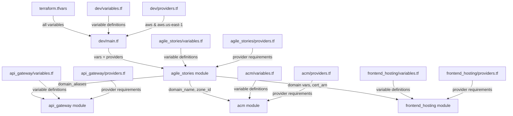

# Terraform Structure and Patterns

## Module Structure

### Root Module (dev/prod)
Environment-specific configurations live here:
- Variable definitions
- Module invocations
- Environment-specific resources
- Provider configurations

### Resource Modules
Located in `modules/` directory, each focused on specific AWS resource types:

#### Lambda Module
```hcl
# modules/lambda/outputs.tf
output "analyze_story_invoke_arn" {
  description = "Invoke ARN for the analyze_story Lambda function"
  value       = aws_lambda_function.analyze_story.invoke_arn
}

output "analyze_story_function_name" {
  description = "Function name for the analyze_story Lambda"
  value       = aws_lambda_function.analyze_story.function_name
}

output "technical_review_invoke_arn" {
  description = "Invoke ARN for the technical_review Lambda function"
  value       = aws_lambda_function.technical_review.invoke_arn
}

output "technical_review_function_name" {
  description = "Function name for the technical_review Lambda"
  value       = aws_lambda_function.technical_review.function_name
}

output "team_estimate_invoke_arn" {
  description = "Invoke ARN for the team_estimate Lambda function"
  value       = aws_lambda_function.team_estimate.invoke_arn
}

output "team_estimate_function_name" {
  description = "Function name for the team_estimate Lambda"
  value       = aws_lambda_function.team_estimate.function_name
}

# Worker function outputs
output "analyze_story_worker_function_name" {
  description = "Function name for the analyze_story_worker Lambda"
  value       = aws_lambda_function.analyze_story_worker.function_name
}

output "technical_review_worker_function_name" {
  description = "Function name for the technical_review_worker Lambda"
  value       = aws_lambda_function.technical_review_worker.function_name
}

output "team_estimate_worker_function_name" {
  description = "Function name for the team_estimate_worker Lambda"
  value       = aws_lambda_function.team_estimate_worker.function_name
}
```

#### API Gateway Module
References Lambda outputs:
```hcl
# modules/api_gateway/main.tf
resource "aws_api_gateway_integration" "analyze_story" {
  rest_api_id = aws_api_gateway_rest_api.api.id
  resource_id = aws_api_gateway_resource.analyze_story.id
  http_method = aws_api_gateway_method.analyze_story.http_method
  integration_http_method = "POST"
  type                    = "AWS_PROXY"
  uri                     = var.analyze_story_invoke_arn  # From Lambda module output
}
```

#### Step Functions Module
References Lambda outputs for worker functions:
```hcl
# modules/step_functions/main.tf
resource "aws_sfn_state_machine" "story_workflow" {
  # ... other configuration ...
  definition = templatefile("${path.module}/workflow.json", {
    analyze_story_worker_arn     = var.analyze_story_worker_function_name
    technical_review_worker_arn  = var.technical_review_worker_function_name
    team_estimate_worker_arn     = var.team_estimate_worker_function_name
  })
}
```

## Best Practices

1. **Module Outputs**
   - Only expose necessary values
   - Use descriptive output names
   - Include descriptions for all outputs
   - Consider output dependencies

2. **Module References**
   - Use module outputs instead of direct resource references
   - Keep environment-specific configuration in root module
   - Pass only required variables to modules

3. **Resource Organization**
   - Group similar resources in modules
   - Keep modules focused and single-purpose
   - Use consistent naming conventions
   - Document module interfaces (inputs/outputs)

## Example Usage in Root Module

```hcl
# dev/main.tf
module "lambda" {
  source = "../modules/lambda"
  # ... other variables ...
}

module "api_gateway" {
  source = "../modules/api_gateway"
  analyze_story_invoke_arn = module.lambda.analyze_story_invoke_arn
  technical_review_invoke_arn = module.lambda.technical_review_invoke_arn
  team_estimate_invoke_arn = module.lambda.team_estimate_invoke_arn
  # ... other variables ...
}

module "step_functions" {
  source = "../modules/step_functions"
  analyze_story_worker_function_name = module.lambda.analyze_story_worker_function_name
  technical_review_worker_function_name = module.lambda.technical_review_worker_function_name
  team_estimate_worker_function_name = module.lambda.team_estimate_worker_function_name
  # ... other variables ...
}
``` 


# Terraform Structure Documentation

## Module Structure Diagram



## Missing Files and Required Content

### Dev Environment
- ✅ terraform.tfvars
- ✅ variables.tf
- ✅ providers.tf
- ✅ main.tf

### agile_stories Module
- ✅ providers.tf
- ✅ variables.tf (with domain variables)
- Need to update main.tf to pass domain variables

### api_gateway Module
- Need providers.tf
- Need to update variables.tf with domain_aliases
- Need to update main.tf for CORS

### acm Module
- ✅ providers.tf
- Need variables.tf with domain variables
- Need main.tf for certificate creation

### frontend_hosting Module
- Need providers.tf
- Need to update variables.tf with domain variables
- Need to update main.tf for CloudFront configuration

## Required Content for Missing Files

### api_gateway/providers.tf
```hcl
terraform {
  required_providers {
    aws = {
      source                = "hashicorp/aws"
      version              = "~> 5.0"
      configuration_aliases = [aws.us-east-1]
    }
  }
}
```

### api_gateway/variables.tf additions
```hcl
variable "domain_aliases" {
  description = "List of domain aliases for CORS configuration"
  type        = list(string)
}
```

### frontend_hosting/providers.tf
```hcl
terraform {
  required_providers {
    aws = {
      source                = "hashicorp/aws"
      version              = "~> 5.0"
      configuration_aliases = [aws.us-east-1]
    }
  }
}
```

### frontend_hosting/variables.tf additions
```hcl
variable "domain_name" {
  description = "Primary domain name"
  type        = string
}

variable "domain_aliases" {
  description = "List of domain aliases for CloudFront"
  type        = list(string)
}

variable "certificate_arn" {
  description = "ARN of the ACM certificate"
  type        = string
}
```

### acm/variables.tf
```hcl
variable "domain_name" {
  description = "Primary domain name"
  type        = string
}

variable "route53_zone_id" {
  description = "Route53 zone ID for DNS validation"
  type        = string
}
```
```

Would you like me to:
1. Add more details to the documentation?
2. Show the main.tf updates needed?
3. Add verification steps to the doc?