# Terraform Structure Documentation

## Module Structure Diagram

```mermaid
graph TD
    %% Environment Level
    TFVARS[terraform.tfvars] -->|all variables| MAIN[dev/main.tf]
    VARS[dev/variables.tf] -->|variable definitions| MAIN
    PROV[dev/providers.tf] -->|aws & aws.us-east-1| MAIN

    %% Main Module
    MAIN -->|vars + providers| AGILE[agile_stories module]
    AGILE_VARS[agile_stories/variables.tf] -->|variable definitions| AGILE
    AGILE_PROV[agile_stories/providers.tf] -->|provider requirements| AGILE

    %% Submodules
    AGILE -->|domain_aliases| API[api_gateway module]
    AGILE -->|domain_name, zone_id| ACM[acm module]
    AGILE -->|domain vars, cert_arn| FRONT[frontend_hosting module]
    AGILE -->|vars| LAMBDA[lambda module]
    AGILE -->|vars| DDB[dynamodb module]
    AGILE -->|vars| SQS[sqs module]
    AGILE -->|vars| VPC[vpc module]

    %% Module Variables
    API_VARS[api_gateway/variables.tf] -->|variable definitions| API
    ACM_VARS[acm/variables.tf] -->|variable definitions| ACM
    FRONT_VARS[frontend_hosting/variables.tf] -->|variable definitions| FRONT
    LAMBDA_VARS[lambda/variables.tf] -->|variable definitions| LAMBDA
    DDB_VARS[dynamodb/variables.tf] -->|variable definitions| DDB
    SQS_VARS[sqs/variables.tf] -->|variable definitions| SQS
    VPC_VARS[vpc/variables.tf] -->|variable definitions| VPC

    %% Provider Requirements
    API_PROV[api_gateway/providers.tf] -->|provider requirements| API
    ACM_PROV[acm/providers.tf] -->|provider requirements| ACM
    FRONT_PROV[frontend_hosting/providers.tf] -->|provider requirements| FRONT
    LAMBDA_PROV[lambda/providers.tf] -->|provider requirements| LAMBDA
    DDB_PROV[dynamodb/providers.tf] -->|provider requirements| DDB
    SQS_PROV[sqs/providers.tf] -->|provider requirements| SQS
    VPC_PROV[vpc/providers.tf] -->|provider requirements| VPC
```



## Missing Files and Required Content

### Dev Environment
- ✅ terraform.tfvars
- ✅ variables.tf
- ✅ providers.tf
- ✅ main.tf

### agile_stories Module
- ✅ providers.tf
- ✅ variables.tf (with domain variables)
- Need to update main.tf to pass domain variables

### api_gateway Module
- Need providers.tf
- Need to update variables.tf with domain_aliases
- Need to update main.tf for CORS

### acm Module
- ✅ providers.tf
- Need variables.tf with domain variables
- Need main.tf for certificate creation

### frontend_hosting Module
- Need providers.tf
- Need to update variables.tf with domain variables
- Need to update main.tf for CloudFront configuration

### lambda Module
- Need providers.tf
- ✅ variables.tf
- ✅ main.tf

### dynamodb Module
- Need providers.tf
- ✅ variables.tf
- ✅ main.tf

### sqs Module
- Need providers.tf
- ✅ variables.tf
- ✅ main.tf

### vpc Module
- Need providers.tf
- ✅ variables.tf
- ✅ main.tf

## Required Content for Missing Files

[Previous content remains the same...]

### lambda/providers.tf
```hcl
terraform {
  required_providers {
    aws = {
      source  = "hashicorp/aws"
      version = "~> 5.0"
    }
  }
}
```

### dynamodb/providers.tf
```hcl
terraform {
  required_providers {
    aws = {
      source  = "hashicorp/aws"
      version = "~> 5.0"
    }
  }
}
```

### sqs/providers.tf
```hcl
terraform {
  required_providers {
    aws = {
      source  = "hashicorp/aws"
      version = "~> 5.0"
    }
  }
}
```

### vpc/providers.tf
```hcl
terraform {
  required_providers {
    aws = {
      source  = "hashicorp/aws"
      version = "~> 5.0"
    }
  }
}
```

[Rest of previous content remains the same...]
```
