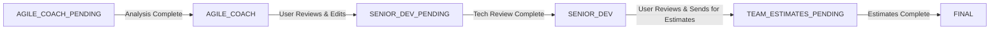

# Story Version Flows

This document outlines the progression of story versions through the system.

## Current Flow (Manual Input)

### Version Descriptions
- **AGILE_COACH_PENDING**: Initial user input, waiting for AI analysis
- **AGILE_COACH**: Story with AI suggestions and improvements
- **SENIOR_DEV_PENDING**: User's edited version after agile coach review, waiting for technical review
- **SENIOR_DEV**: Story with technical considerations and implementation details
- **TEAM_ESTIMATES_PENDING**: User's edited version after tech review, waiting for team estimates
- **FINAL**: Complete story with all reviews and estimates

## Future Flow (JIRA Integration)

```mermaid
graph LR
    A[ORIGINAL] -->|User Edits| B[USER_EDITED]
    B -->|Send for Analysis| C[AGILE_COACH_PENDING]
    C -->|Analysis Complete| D[AGILE_COACH]
    D -->|User Reviews & Edits| E[SENIOR_DEV_PENDING]
    E -->|Tech Review Complete| F[SENIOR_DEV]
    F -->|User Reviews & Sends for Estimates| G[TEAM_ESTIMATES_PENDING]
    G -->|Estimates Complete| H[FINAL]
```

### Version Descriptions
- **ORIGINAL**: Raw story imported from JIRA
- **USER_EDITED**: Story after initial user modifications
- **AGILE_COACH_PENDING**: Edited story waiting for AI analysis
- **AGILE_COACH**: Story with AI suggestions and improvements
- **SENIOR_DEV_PENDING**: User's edited version after agile coach review, waiting for technical review
- **SENIOR_DEV**: Story with technical considerations and implementation details
- **TEAM_ESTIMATES_PENDING**: User's edited version after tech review, waiting for team estimates
- **FINAL**: Complete story with all reviews and estimates

## Content at Each Stage

Each version contains:
- Full story content from previous stage
- New analysis/review content specific to that stage
- Metadata (story_id, tenant_id, timestamps)

This ensures:
1. Complete history of story evolution
2. Ability to track changes at each stage
3. Clear indication of story state
4. No data loss between stages 